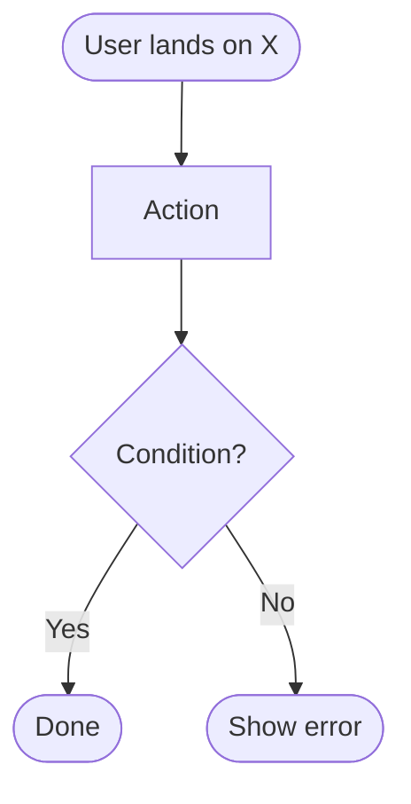
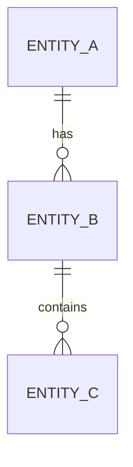
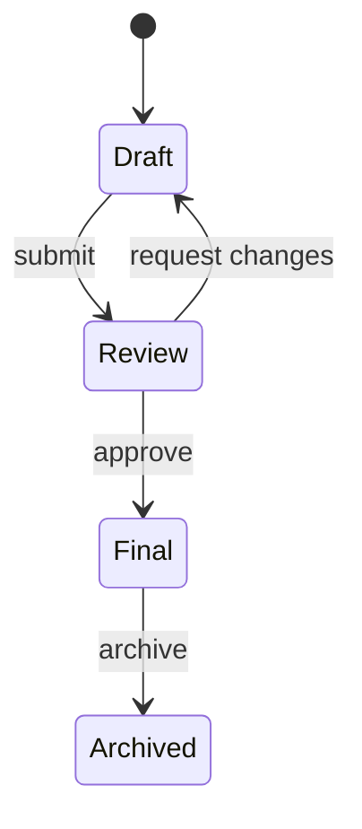
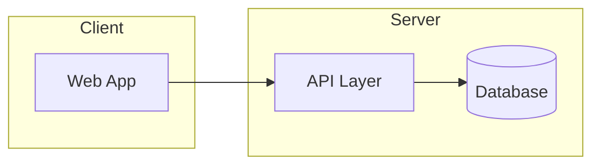
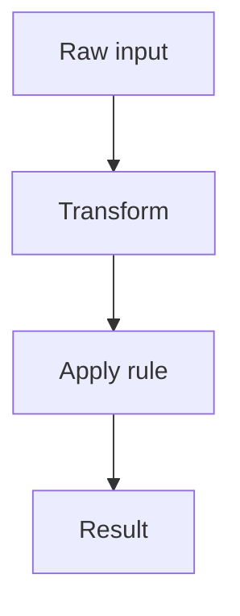
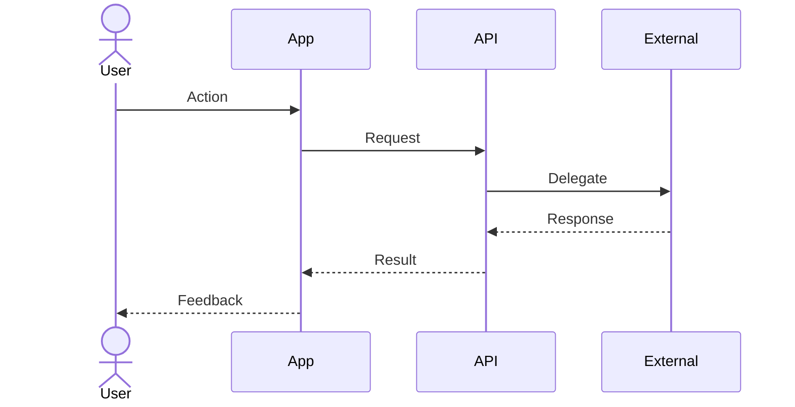

# SPEC-{NNN}: {Short Epic Title}

> **How to use this template**
>
> - Include sections that carry signal. Omit sections that do not apply to this spec's scope — do not leave `N/A — reason` placeholders. For medium or large specs, include all sections.
> - No code. Describe everything in prose + mermaid diagrams. This epic is read by both an AI agent (as a prompt to decompose the work into tasks) and a human (to validate intent).
> - Concrete examples over abstractions. Name real personas, quote real copy, link to real source materials.
> - Delete these instructions when the spec is filled in.

---

## 1. Meta

| Field | Value |
|---|---|
| Spec ID | SPEC-{NNN} |
| Title | {Short Epic Title} |
| Status | `draft` / `in-review` / `approved` / `in-progress` / `done` / `archived` |
| Brownfield | yes / no — `yes` ⇒ `recon.md` exists in this directory and was written before this epic (see §4) |
| Version | 0.1 |
| Owner | {name} |
| Contributors | {names} |
| Created | YYYY-MM-DD |
| Last updated | YYYY-MM-DD |
| Target release | {milestone / date / TBD} |
| Related specs | {SPEC-XXX, SPEC-YYY} |

---

## 2. Summary

One paragraph. What this epic delivers and why it matters. Readable to a non-technical stakeholder.

---

## 3. Business goal

Why the business wants this. Tie to strategy, revenue, compliance, market, or user pain. Quantify where possible.

- **Primary goal:**
- **Secondary goals:**
- **Non-goals (things this is explicitly NOT trying to solve):**

---

## 4. Context & background

What led to this epic now. Prior decisions, user research, incidents, market signals.

- **Trigger:** why now
- **Prior art:** what exists today. **For a brownfield spec, cite [`recon.md`](./recon.md) rather than restating it** — two copies of the same survey drift, and the recon is the one with citations.
- **Related research:** links
- **Decisions already made upstream:** anything fixed that this epic must respect

---

## 5. Glossary

Terms used inside this epic that a new contributor or AI agent might misinterpret. Domain-specific terms, product nouns, internal jargon. Keep it local — only terms that appear in this epic.

| Term | Definition | Source |
|---|---|---|
| ... | ... | ... |

---

## 6. Users & roles affected

Which product roles this epic touches and how each is impacted. One paragraph per affected role.

- **{Role A}:**
- **{Role B}:**
- **Regional / segment variations:** how behavior differs per locale or segment, if at all.

---

## 7. User stories & scenarios

Concrete narratives, not abstractions.

### 7.1 Primary user stories

Format: `As a <role>, I want <capability>, so that <outcome>.`

- US-1: ...
- US-2: ...

### 7.2 Happy-path scenario

Walk through the main flow as a story. Name a specific persona and describe their path step by step.

### 7.3 Edge-case scenarios

At least 3–5 non-happy scenarios. Each as a short narrative.

- **Scenario A — {name}:** what happens, expected outcome
- **Scenario B — {name}:** ...
- **Scenario C — {name}:** ...

---

## 8. Functional requirements

What the system must be able to do. Prioritized list. Use `MUST` / `SHOULD` / `MAY` (RFC-2119 style).

- FR-1 **MUST**: ...
- FR-2 **MUST**: ...
- FR-3 **SHOULD**: ...
- FR-4 **MAY**: ...

Group by sub-capability if the list is long.

---

## 9. UX / Design

### 9.1 Screens & states

For each screen this epic introduces or changes:

- **Screen name** — purpose in one sentence
- **States:** default / empty / loading / error / success / permission-denied / offline (whichever apply)
- **Key interactions:**
- **Locale / direction notes:** language and RTL/LTR considerations

### 9.2 User flows (mermaid)

### 9.3 Copy

Key strings shown to the user, in each language the product supports.

| Key | Lang A | Lang B |
|---|---|---|
| heading.main | ... | ... |
| cta.primary | ... | ... |

### 9.4 Design system usage

- **Which brand / surface:**
- **Which UI kit:**
- **Tokens / primitives used:**
- **New components needed:**
- **Accessibility notes:** contrast, keyboard paths, screen-reader labels

---

## 10. Data model

### 10.1 Entities

Prose description of every entity this epic introduces or modifies. For each: name, purpose, key fields (conceptual, not column types), lifecycle, retention rules.

- **Entity A** — purpose; fields: `...`; lifecycle: `created → ... → archived`

### 10.2 Entity relationships (mermaid)

### 10.3 State transitions (mermaid)

For entities with non-trivial lifecycle.

---

## 11. Architecture & technologies

### 11.1 Component diagram (mermaid, C4-style)

### 11.2 Stack choices

For each layer touched: technology + rationale. Flag deviations from the project default stack (see project CLAUDE.md).

- **Frontend:**
- **State:**
- **API / server:**
- **Data store:**
- **Integrations:**

### 11.3 Rationale & alternatives

Why these choices, what was rejected, what the tradeoff is. For a brownfield spec, the constraints you are working within are in [`recon.md`](./recon.md) §2 and §4 — cite them, do not re-derive them.

### 11.4 Documentation impact

List every documentation surface this epic must update **in the same PR (or in a clearly named follow-up PR opened within the same merge window)**. Fill at draft time, not after — forgetting a section is how architecture docs drift from code. Refer to the project's CLAUDE.md for the area→section mapping.

| Doc | Why this epic touches it | Updated |
|---|---|---|
| `docs/architecture/0X-...` | new endpoint / table / flow step / env var / port / audit action | [ ] |
| `docs/architecture/README.md` | "As of" bump + one-line entry summarising the epic | [ ] |
| `docs/prod-readiness.md` | new pre-prod human step (console setting, DNS, partner review, SA provisioning) | [ ] |
| `docs/future-work.md` | each item §21 out-of-scopes with clear intent to do later | [ ] |
| user-facing README / CHANGELOG | only if a behaviour change is visible to external consumers | [ ] |

If an entry above genuinely doesn't apply, delete the row — do not leave `N/A` placeholders.

---

## 12. Algorithms & business logic

Non-trivial logic: scoring, matching, eligibility rules, pricing. Each algorithm gets a named sub-section with a mermaid flowchart and a prose description of inputs / outputs / invariants.

### 12.1 {Algorithm name}

- **Purpose:**
- **Inputs:**
- **Outputs:**
- **Invariants / edge cases:**
- **Flow:**

---

## 13. API / interfaces

Describe every external-facing interface in prose. No code. Include shape, inputs, outputs, errors, auth requirements, idempotency.

### 13.1 {Endpoint or interface name}

- **Purpose:**
- **Caller:** (role, client)
- **Inputs:** field list with types and validation rules in prose
- **Outputs (success):**
- **Errors:** enumerated with user-facing messages
- **Authorization:** which roles may call
- **Idempotency / retries:**

### 13.2 Sequence diagram (mermaid)

For interactions involving more than two actors or async steps.

---

## 14. Permissions matrix

Who can do what. Rows = roles, columns = actions. `C` create, `R` read, `U` update, `D` delete, `—` no access.

| Action | {Role A} | {Role B} | {Role C} | Admin |
|---|---|---|---|---|
| ... | ... | ... | ... | ... |

Call out any non-obvious rules (consent-based visibility, time-limited access, segment-specific gates).

---

## 15. Dependencies

### 15.1 Internal dependencies

Other specs, modules, or features that must exist for this epic to work.

- Depends on: SPEC-XXX (`{title}`) — reason
- Blocks: SPEC-YYY — reason

### 15.2 External dependencies

Third-party services and their role. Note auth model, rate limits, failure modes.

- {Service} — why, what we call, fallback if unavailable

---

## 16. Non-functional requirements

### 16.1 Performance

- Target page / interaction timings
- Data-volume assumptions

### 16.2 Accessibility

- WCAG level
- Keyboard navigation requirements
- Screen-reader requirements
- Color-contrast notes

### 16.3 Internationalization

- Languages required
- RTL / LTR behavior
- Units / currency / date formats per region

### 16.4 Compliance & privacy

- Regulatory touchpoints (HIPAA, FERPA, GDPR, etc.)
- Handling of sensitive data
- Consent model
- Data retention period

### 16.5 Responsive & device support

- Breakpoints
- First-class device targets
- Touch-target minimum

### 16.6 Offline / connectivity

- What works offline, what requires network
- Conflict resolution on reconnect

### 16.7 Security

- Authentication requirements
- Authorization model (see §14)
- Sensitive-data handling
- Audit logging

---

## 17. Analytics & telemetry

Events to emit, properties to attach, dashboards to update. Tie each event back to a success metric in §24.

| Event name | When fired | Properties | Used for |
|---|---|---|---|
| `...` | ... | ... | ... |

---

## 18. Testing & verification

### 18.1 Test strategy

Types of tests needed (unit, integration, e2e, visual regression, a11y, manual QA). Which levels cover which requirements.

### 18.2 Test scenarios

Concrete scenarios that must be verified. Link to user stories and acceptance criteria.

- T-1: {scenario} — covers US-1, AC-1
- T-2: ...

### 18.3 Data & fixtures

- What test data is needed (real samples, synthesized fallback with explicit disclosure, anonymized)
- Locale coverage
- Regional / segment coverage

### 18.4 Manual verification checklist

Steps a human runs before approving the epic as done.

- [ ] Happy path in primary language
- [ ] Happy path in secondary language
- [ ] Each edge-case scenario
- [ ] Accessibility pass (keyboard-only + screen reader)
- [ ] Responsive check across device targets

### 18.5 Verification rigour gate (per task)

Every task in this spec is held to the universal verification-rigour rules in `SKILL.md` § "Verification rigour" PLUS the spec-specific surfaces in [`verification-checklist.md`](./verification-checklist.md). The agent's hand-off summary uses the §8 template from that file. MANDATORY items cannot be skipped silently.

If this spec touches surfaces not yet covered by the universal floor (specific localised content, object-storage round-trips, numerical assertions, multi-region behaviour, etc.), add them as §10+ in `verification-checklist.md`.

---

## 19. Rollout plan

- **Feature flag?** yes / no / name
- **Staged rollout?** which users first
- **Migration:** backfill or transformation of existing data? How?
- **Destructive DDL?** List every `DROP COLUMN` / `DROP TABLE` / type narrowing / `NOT NULL`-on-populated this epic performs, and what data each discards. If none, state `none`. Anything listed here requires explicit user confirmation at the moment its wave merges — reverting the wave's code does not bring the data back.
- **Backwards compatibility:** does this break prior behavior? How is it handled?
- **Kill switch:** how to disable if something goes wrong

---

## 20. Acceptance criteria

Testable conditions, ideally in Given-When-Then form. When all are green, the epic is done.

- **AC-1** — **Given** {state} / **When** {action} / **Then** {observable outcome}
- **AC-2** — ...
- **AC-3** — ...

---

## 21. Out of scope

Explicit list of adjacent things this epic does **not** cover. Protects against scope creep.

- ...
- ...

---

## 22. Open questions

Unresolved questions that must be answered before or during execution. Track each with status.

| # | Question | Owner | Status | Resolution |
|---|---|---|---|---|
| Q1 | ... | ... | open / answered | ... |

---

## 23. Risks & assumptions

### 23.1 Risks

| Risk | Likelihood | Impact | Mitigation |
|---|---|---|---|
| ... | low / med / high | low / med / high | ... |

### 23.2 Assumptions

Things taken for granted. If any breaks, the epic may need rework.

- ...

---

## 24. Success metrics

How we know this worked after launch. Tie each metric to the business goal in §3.

- **Metric 1:** {name} — current baseline, target, measurement window
- **Metric 2:** ...

---

## 25. References

- PRD / stakeholder docs: {links}
- Source materials: {links}
- Design system: {link}
- Related specs: `docs/specs/SPEC-XXX/`
- External references: {links}

---

## 26. Change log

Every change to this epic **after** it first reached `in-review` gets a row — this is the audit trail for the requirements themselves, the counterpart to `review.log.md` for the reviews. A re-plan bumps `Version` in §1 and adds a row here **before** any task is regenerated.

| Date | Version | What changed (sections) | Tasks invalidated | Reason | Approved by |
|---|---|---|---|---|---|
| YYYY-MM-DD | 0.1 | initial draft | — | — | — |
| YYYY-MM-DD | 0.2 | §8 FR-N reworded, §20 AC-M added | T-004, T-007 | {what forced the change — a blocker, a review finding, a decision} | {name} |

Under `Compliance critical: true`, editing this epic without adding a row here is a **halt**, not a warning.
