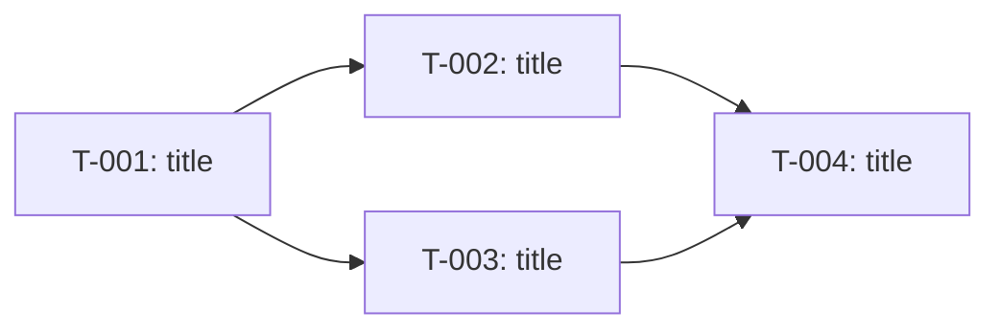

# SPEC-{NNN} — Execution plan

> **How to use this template**
>
> - The plan is produced after `tasks.md` is filled and at least partially reviewed.
> - The plan is executed by an **orchestrator agent** (the session you are in) that spawns **task agents** (one per task, via Agent tool) and coordinates waves.
> - Before running Wave 1, the orchestrator MUST ask the user which execution mode to use (see Meta).
> - The plan is a living document: the orchestrator updates the Progress log as tasks complete and re-plans if a failure cascades (see SKILL.md failure policy).
> - Delete these instructions when the file is filled in.

---

## 1. Meta

| Field | Value |
|---|---|
| Parent epic | [SPEC-{NNN}: {title}](./epic.md) |
| Tasks source | [tasks.md](./tasks.md) |
| Status | `not-started` / `in-progress` / `completed` / `blocked` — the aggregate of task progress, written by the orchestrator. Tasks close → this closes → `epic.md` §1 goes `done`. Never ahead of the epic's `approved` |
| Created | YYYY-MM-DD |
| Last updated | YYYY-MM-DD |

### Execution preferences (v1.0 — all optional; absent ⇒ default ⇒ pre-1.0 behaviour)

These rows configure execution. **All optional.** A `plan.md` with none of them executes exactly as pre-1.0. The agent resolves them by precedence: invoke flag → these rows → project `CLAUDE.md` defaults → skill defaults. Strictness is concentrated on the safety rows (`Engine`, `Review *`, `Compliance critical`): on an unrecognised value the agent stops and asks — it does not guess.

| Field | Value (accepted — default) |
|---|---|
| Engine | `auto` / `task-tool` / `dw` — default `task-tool` |
| Stop mode | `auto` / `per-wave` / `per-task` — default `per-wave`. Subsumes pre-1.0 "Execution mode" (`auto`→`auto`, `paused-between-waves`→`per-wave`). Under `dw`, `per-task` ⇒ one task per wave. |
| Concurrency cap | int ≥ 1 — default `3` (raise only with explicit user approval) |
| DW min tasks | int ≥ 1 — default `8` (auto-dispatch threshold) |
| DW min parallel ratio | 0.0–1.0 — default `0.6` (auto-dispatch threshold; ratio = widest-wave-width / total-tasks) |
| Review enabled | `true` / `false` — default `false` |
| Review pattern | `adversarial` / `spot-check` / `none` — default `adversarial` when review is enabled |
| Review fail action | `revise` / `halt` / `flag-only` — default `revise` |
| Compliance critical | `true` / `false` — default `false`. When `true`: `dw` blocked (override only `--allow-dw-on-compliance` + confirmation); review forced `true`+`adversarial`; `flag-only` rejected. |

---

## 2. Summary

- **Total tasks:** {N}
- **Total waves:** {M}
- **Critical path length:** {K} tasks
- **Estimated max parallelism:** {min(largest-wave, concurrency-cap)}

One paragraph describing the shape of the work (e.g., "Foundation task blocks all others; after T-001 the work fans out into three independent tracks that converge at T-012 for integration testing").

---

## 3. Dependency graph

Nodes = task IDs + short title. Edges = `blockedBy` (source blocks target).

---

## 4. Critical path

The longest chain of blocking tasks. Shortening any of these shortens the epic.

`T-001 → T-002 → T-004 → T-007`  (length: 4)

Why it matters: parallelism cannot compress this chain. Watch for blockers on these tasks first.

---

## 5. Dry-run preview

Produced by the orchestrator before Wave 1. Flags risks visible from task metadata alone.

### 5.1 Path overlaps (merge risk)

Tasks in the same wave that touch overlapping `Scope paths`. Review before starting the wave.

| Wave | Tasks | Overlapping path | Risk level |
|---|---|---|---|
| 1 | T-002, T-003 | `packages/contracts/*` | medium — both modify shared types |

### 5.2 External dependencies

Aggregated across all tasks.

- **Packages:** `...`
- **Env vars:** `...`
- **External services:** `...`

### 5.3 Language / toolchain mix

| Language | Tasks |
|---|---|
| TS | T-001, T-002, T-004 |
| Go | T-003, T-005 |
| SQL (migrations) | T-006 |

---

## 6. Execution waves

### Wave 1

- **Tasks:** T-001, T-002, T-003
- **Parallel agents:** 3 (Agent A → T-001, Agent B → T-002, Agent C → T-003)
- **Sub-waves:** none (fits in cap)
- **Integration checkpoint:** after all three complete, orchestrator runs merge and verifies `packages/contracts/*` consistency.
- **Review gate at wave end:** {none / code-review (auto) / security-review (auto) / user reminder for `/ultrareview`}

### Wave 2

- **Tasks:** T-004, T-005
- **Blocked on:** Wave 1 complete
- **Parallel agents:** 2 (Agent A → T-004, Agent B → T-005)
- **Sub-waves:** none
- **Integration checkpoint:** ...
- **Review gate at wave end:** ...

### Wave N

- ...

---

## 7. Sub-waves (when concurrency cap is exceeded)

If a wave contains more tasks than the concurrency cap, split into sub-waves in the same section:

### Wave X — Sub-wave X.1

- **Tasks:** T-010, T-011, T-012 (cap = 3)

### Wave X — Sub-wave X.2

- **Tasks:** T-013, T-014
- **Starts after:** X.1 complete

Sub-waves share Wave X's integration checkpoint and review gate; they are batched internally for agent-count reasons only.

---

## 8. Review gates

Summary of review steps and how they are triggered. Per-wave placement is noted in §6.

| Gate | When | How triggered | Notes |
|---|---|---|---|
| Code review (automated) | end of each wave / epic | orchestrator invokes `code-review` skill on the merged wave branch | catches style / correctness / obvious defects |
| Security review (automated) | when wave touches auth / data / consent / PII / PHI | orchestrator invokes `security-review` skill automatically | mandatory for sensitive paths |
| DB change review | wave contains a migration or DDL | orchestrator invokes the project's DB-review skill if installed; otherwise mark `aspirational — not wired as of YYYY-MM-DD` | destructive DDL also needs explicit user confirmation at wave merge; down-migration verified before merge |
| Code review (thorough, user-run) | at epic end | **user runs `/ultrareview`** — orchestrator reminds at hand-off | multi-agent cloud review, cannot be auto-triggered |
| Architecture review | at epic end (for non-trivial epics) | orchestrator runs review agent with prompt "compare epic §11-13 with actual implementation, list deviations" | placeholder until a dedicated skill exists |
| User functional verification | at epic end | **user runs manual verification checklist** — orchestrator surfaces the aggregated checklist | covers visual polish, RTL, accessibility-by-feel |

---

## 9. Risk register (execution-level)

Risks about the *execution* of the plan, not the feature itself (those are in the epic).

| Risk | Likelihood | Impact | Mitigation |
|---|---|---|---|
| External service rate-limit during Wave 2 | low | medium | pre-check quota; fallback to mock |
| Wave 1 contract change cascades into Wave 2 re-work | medium | high | lock contracts at end of Wave 1 |
| ... | ... | ... | ... |

---

## 10. Failure policy (reference)

See `SKILL.md` for the canonical rules. Summary:

- Task fails mid-wave → mark `blocked`, continue other in-flight tasks, deprioritise dependents to a later wave.
- If failure invalidates the epic's assumptions → orchestrator pauses the plan and proposes a re-plan (update epic → update tasks → regenerate plan).

---

## 11. Progress log

**Written by the orchestrator only — task agents return their row in the hand-off, they do not edit this file.** Most-recent at the bottom.

| Task | Wave | Agent | Started | Completed | Status | Notes |
|---|---|---|---|---|---|---|
| T-001 | 1 | A | YYYY-MM-DD HH:MM | YYYY-MM-DD HH:MM | completed | ... |
| T-002 | 1 | B | YYYY-MM-DD HH:MM | — | in-progress | ... |
| T-003 | 1 | C | — | — | not-started | ... |
