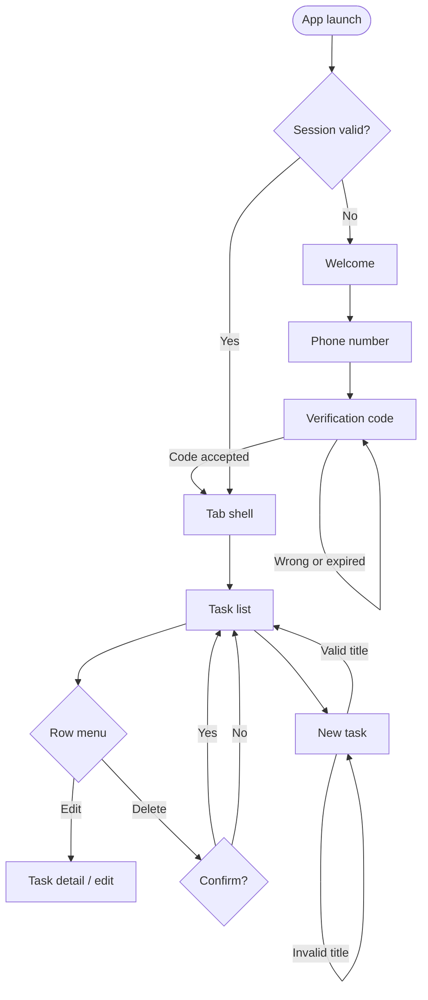
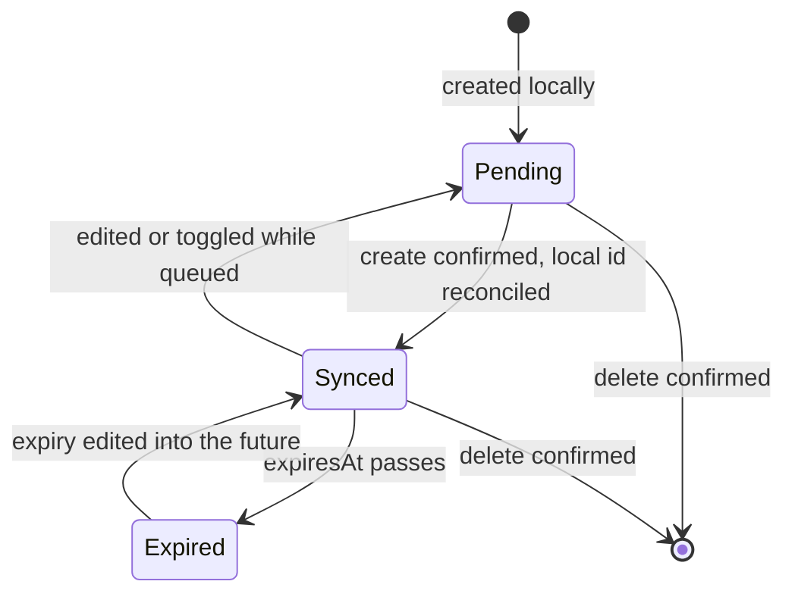
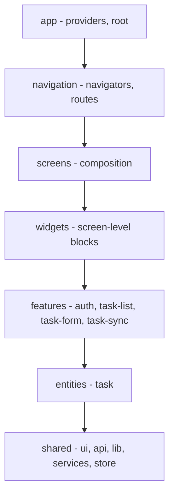
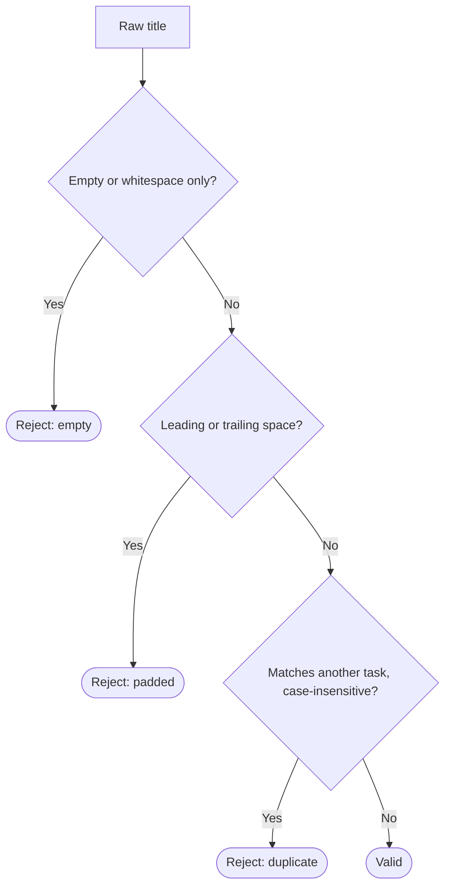
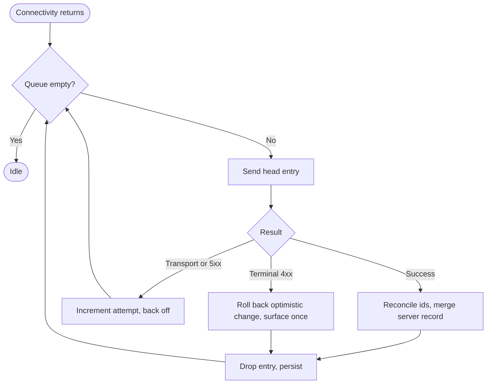

# SPEC-001: Focus & Flow — offline-first to-do application

## 1. Meta

| Field          | Value                                                   |
| -------------- | ------------------------------------------------------- |
| Spec ID        | SPEC-001                                                |
| Title          | Focus & Flow — offline-first to-do application          |
| Status         | `done`                                                  |
| Brownfield     | no — greenfield project, scaffolded in the same session |
| Version        | 0.4                                                     |
| Owner          | Kirill Ter                                              |
| Created        | 2026-09-01                                              |
| Last updated   | 2026-09-02                                              |
| Target release | 2026-09-02, 16:00 IDT                                   |
| Related specs  | —                                                       |

---

## 2. Summary

A single-user to-do application for iOS. The user signs in with a phone number and an
SMS code, then captures, categorises, completes, edits, and deletes tasks. Every read is
served from a local cache first and every write is queued locally, so the application is
fully usable with no network and reconciles itself when connectivity returns.

The work is a technical assignment judged on three things, in this order: the clarity of
the Feature-Sliced Design architecture, the honesty of the offline-first implementation,
and fidelity to the supplied design. It is deliberately a small amount of code carrying a
large amount of engineering judgement.

---

## 3. Business goal

- **Primary goal:** demonstrate senior-level React Native engineering judgement on a
  small, complete, running application.
- **Secondary goals:** a codebase another engineer could extend without asking questions;
  decisions visible in the structure rather than explained in a document.
- **Non-goals:** a shippable product, store distribution, multi-user support, a backend of
  our own.

---

## 4. Context & background

- **Trigger:** a technical assignment issued by the hiring team, delivered with a flow
  diagram, a high-fidelity design, and a fixed task API.
- **Prior art:** none in this repository. The project was scaffolded from the React Native
  CLI template in this session.
- **Decisions already made upstream** — these are fixed and this epic must respect them:
  - Firebase for authentication, project `todolist-b4a98`, phone provider, already
    configured. Anything that looks like it needs enabling in the Firebase console is a
    signal the implementation is going the wrong way.
  - No Expo. No Redux.
  - iOS only.
  - The task API is a fixed mockapi.io resource; we do not control its schema.
  - Bundle identifier `org.reactjs.native.example.CaliAlfa`, dictated by the Firebase
    registration.
  - React Native pinned to 0.80.3 — 0.81+ requires Xcode 16.1, the build machine has 16.0.

The full requirements record, including every clarification answered by the assignment
author, is in `Tech Assignment/REQUIREMENTS.md` outside this repository.

---

## 5. Glossary

| Term               | Definition                                                                                                                                    |
| ------------------ | --------------------------------------------------------------------------------------------------------------------------------------------- |
| **Task**           | The single domain entity. Title, description, category, done flag, creation time, optional expiry                                             |
| **Expired task**   | A task whose `expiresAt` is in the past. Its completion checkbox is disabled; it can still be edited and deleted                              |
| **Category**       | A free-text label on a task. The selectable list is derived from the categories present in the loaded tasks; the user may also type a new one |
| **Mutation queue** | The ordered, persisted list of writes the device has accepted but not yet confirmed with the server                                           |
| **Local id**       | A client-minted identifier for a task created offline, replaced by the server id after the first successful sync                              |
| **Reconciliation** | Replacing a local id with the server id and merging the server's authoritative record into the cache                                          |

---

## 6. Users & roles affected

There is exactly one role. A signed-in person owns every task in the system: the mockapi
resource is dedicated to this candidate and carries no owner field, so any authenticated
user sees the same list. This is a property of the supplied API, not a design choice, and
it is recorded here so that a reader does not mistake it for an oversight.

The reviewer is a second, practical audience: they will run the application on their own
Mac and sign in with the Firebase test number. Anything that only works on the developer's
machine is not done.

---

## 7. User stories & scenarios

### 7.1 Primary user stories

- **US-1** — As a new user, I want to sign in with my phone number, so that I do not have
  to invent and remember another password.
- **US-2** — As a user, I want to write a task down in a couple of taps, so that the tool
  does not become the reason I lose the thought.
- **US-3** — As a user, I want to see at a glance how much of today is done, so that I get
  a sense of momentum rather than a backlog.
- **US-4** — As a user, I want to find a task by typing part of its title, so that a long
  list stays usable.
- **US-5** — As a user, I want to correct or remove a task I entered wrongly, so that the
  list stays trustworthy.
- **US-6** — As a user on a train with no signal, I want the app to keep working, so that
  my thoughts still land somewhere and appear on the server later.

### 7.2 Happy-path scenario

Dana opens the app for the first time. The welcome screen explains what it is; she taps
**Next**, types her phone number, and receives a six-digit code. After entering it she
lands on the task list, which shows the tasks already on the server together with a
momentum card reading "2 of 5 tasks completed".

She taps the floating **New task** button, types "Call the notary", picks the existing
category "Work" from the suggestions, leaves the description and the expiry empty, and
taps **Add task**. The task appears at the top of the list immediately, marked as not
done.

Later she taps its checkbox. The title strikes through and the momentum card updates. The
next morning she opens the app in the metro with no signal: the list is there, she adds
another task, and the offline banner tells her changes will sync. When she surfaces, the
banner disappears and both changes are on the server.

### 7.3 Edge-case scenarios

- **Scenario A — duplicate title.** Dana types a title that already exists. The submit
  button stays disabled and an inline message under the field says the task already exists.
  Nothing is sent.
- **Scenario B — whitespace-only title.** She types three spaces. Same treatment: the
  field is not accepted, and a title with leading or trailing spaces is rejected rather
  than silently trimmed.
- **Scenario C — expired task.** A task's expiry passed at midnight. Its card is muted and
  its checkbox is disabled, but the three-dot menu still offers Edit and Delete. If she had
  completed it before it expired, it keeps its completed styling.
- **Scenario D — deletion the user did not mean.** She opens the row menu and taps Delete.
  A confirmation sheet names the task. Cancelling leaves everything untouched.
- **Scenario E — the write fails permanently.** A queued update is refused by the server.
  The optimistic change rolls back, the queue entry is discarded rather than retried
  forever, and the banner says so until a later change gets through — at which point the
  sentence is no longer true of the most recent thing to have happened, and clears itself.

  A 404 on an update or a delete is the exception: the record is already gone, which is the
  outcome the user asked for, so the entry and the local copy are dropped in silence.

- **Scenario H — the list cannot be loaded.** The first sync reaches the server and the
  server refuses it. Connectivity is fine, so no offline banner is due and nothing will
  re-run the sync on its own; the screen would otherwise show the cached list with no way
  to tell it apart from a complete one. A sheet says the list could not be loaded, says the
  tasks on screen are the copy saved on this device, and offers a retry.
- **Scenario F — cold start with no network.** The app is opened for the first time that
  day in airplane mode. The cached list renders before any request is attempted; the
  offline banner is visible; the session is still valid, so no sign-in is requested.
- **Scenario G — first sign-in with no network.** Firebase phone verification cannot
  complete offline. The user is told plainly that signing in needs a connection. This is
  the one flow that is not offline-capable, and it is a property of the provider.

---

## 8. Functional requirements

### Authentication

- FR-1 **MUST** — Sign in with a phone number and a six-digit SMS code, through Firebase
  phone authentication.
- FR-2 **MUST** — The session survives an app restart; a returning user is not asked to
  sign in again.
- FR-3 **MUST** — Sign out is available in the Settings tab and returns the user to the
  welcome screen.
- FR-4 **MUST** — The OTP screen handles a wrong code, an expired code, and a provider
  quota error, each with a distinct message, plus a resend action gated by a 60-second
  countdown.
- FR-5 **MUST** — An unauthenticated user cannot reach the task tabs; an authenticated one
  cannot reach the auth screens.

### Tasks

- FR-6 **MUST** — The list shows every task, newest first. Completing a task does **not**
  move it, so a row never jumps out from under the user's finger.
- FR-7 **MUST** — A task is created with a required title and optional description,
  category, and expiry. It is created as not done.
- FR-8 **MUST** — Completion toggles in both directions.
- FR-9 **MUST** — Each row carries a three-dot button revealing Edit and Delete beneath the
  card. There is no long-press gesture.
- FR-10 **MUST** — Delete asks for confirmation in a bottom sheet naming the task.
- FR-11 **MUST** — A task can be edited on its own screen: title, description, category,
  expiry, and completion.
- FR-12 **MUST** — A task whose expiry has passed is disabled: muted card, disabled
  checkbox. Its Edit and Delete actions stay active. A task completed before it expired
  keeps its completed styling.
- FR-13 **MUST** — Search filters by title, on the client, debounced at 200 ms.
- FR-14 **MUST** — Title validation, from the assignment's own flow diagram: a title that
  duplicates an existing task is rejected; a title that is empty or only whitespace is
  rejected; a title with leading or trailing whitespace is rejected. Rejection shows an
  inline message and keeps the submit button disabled.
- FR-15 **MUST** — The category field offers the distinct categories present in the loaded
  tasks and accepts a new one typed by the user.
- FR-16 **SHOULD** — A momentum card shows completed and total counts with a progress bar.
  Expired tasks count towards both.
- FR-17 **MUST** — Distinct empty states for "no tasks at all" and "no search results".

### Offline

- FR-18 **MUST** — The full task list is cached locally and rendered on cold start before
  any network request is issued.
- FR-19 **MUST** — Create, update, toggle, and delete are accepted while offline, appended
  to a persisted mutation queue, and replayed in order when connectivity returns.
- FR-20 **MUST** — Every mutation is applied optimistically and rolled back if it fails
  terminally.
- FR-21 **MUST** — A task created offline receives a local id, which is reconciled with the
  server id after its create succeeds. Mutations queued against a local id follow it.
- FR-22 **MUST** — Conflicts resolve last-write-wins by client timestamp.
- FR-23 **MUST** — The UI shows when the device is offline and when queued changes are
  still pending.
- FR-24 **MUST** — The first sync fetches pages via the API's pagination parameters; after
  that the full set lives in the cache and all listing, filtering, and search run against
  the cache.

### Shell

- FR-25 **MUST** — Three tabs: Tasks, Calendar, Settings. Calendar is a placeholder with a
  "Coming soon" banner. Settings carries the signed-in number and sign-out.
- FR-26 **MUST** — The task list header shows a centred "To-do" title with no back button
  and no search icon; the on-screen search field is the only search affordance.

### Error reporting

- FR-27 **MUST** — A first sync that fails without the device being offline is reported in
  the foreground, with a retry. Nothing else re-runs it: the sync is re-triggered by
  connectivity changing, and a server that answers and refuses leaves connectivity
  reporting online.
- FR-28 **MUST** — A report of a rejected change clears itself once a later change reaches
  the server. It survives the successes drained in the same pass as the failure, so that a
  rollback is never left on screen with nothing saying why.

---

## 9. UX / Design

The design is final and lives in `Tech Assignment/design/`. The canvas sources
(`*.dc.html`) are the authoritative reference for exact values; the PNG exports are for
visual comparison. Fifteen artboards cover every screen and state listed below.

### 9.1 Screens & states

| Artboard | Screen             | States covered                                                                                                                      |
| -------- | ------------------ | ----------------------------------------------------------------------------------------------------------------------------------- |
| A1       | Welcome            | single                                                                                                                              |
| A2       | Phone number       | default, submit disabled until plausible                                                                                            |
| A3–A5    | Verification code  | empty, filled and valid, error                                                                                                      |
| B1       | Task list          | default                                                                                                                             |
| B2       | Task list          | row action menu open                                                                                                                |
| B3       | Task list          | delete confirmation sheet                                                                                                           |
| B4       | Task list          | empty, no tasks                                                                                                                     |
| B5       | Task list          | empty, no search results                                                                                                            |
| B6       | New task           | default                                                                                                                             |
| B7       | New task           | title validation error                                                                                                              |
| B8       | Task detail / edit | default                                                                                                                             |
| C1       | Calendar           | coming soon                                                                                                                         |
| C2       | Settings           | default                                                                                                                             |
| D        | Component sheet    | task row in default / completed / expired / expired-completed / menu-open, checkbox, chip, buttons, inputs, tab bar, offline banner |

Frame: 402 × 874 pt, safe areas 59 pt top and 34 pt bottom, 20 pt horizontal margin.

Two surfaces have no artboard. The country-prefix picker was drawn in a later round, once the
phone field's dropdown turned out to have no mobile equivalent. The sheet that reports a failed
first sync has none at all: it answers a state the design round never posed a question about,
and it is built from the same sheet chrome as B3 rather than from anything new.

### 9.2 Primary flow

### 9.3 Design system

- **Tokens:** the palette, type scale, spacing rhythm, radii, and two elevation levels come
  from `Tech Assignment/stitch_modern_todo_list_ui/focus_flow/DESIGN.md`, extended by the
  design round with one token the original omitted: `success = #0f7a52`, used for a checked
  checkbox and for completion only. It passes 5.4:1 on white.
- **Typography:** Inter, bundled. `headline-lg` renders at 28 pt on mobile, not 32.
- **Theme:** one light theme. No dark mode; the OS appearance APIs are banned.
- **Icons:** Material Symbols Outlined at a consistent weight.
- **Accessibility:** an accessibility role and label on every interactive element; the
  44 pt touch floor is reached through hit area in the shared pressable primitive, never by
  inflating a visual size.

---

## 10. Data model

### 10.1 Entities

**Task** — the only domain entity. Fields as the API defines them:

| Field         | Meaning                                                                                     |
| ------------- | ------------------------------------------------------------------------------------------- |
| `id`          | Server identifier. Opaque; never parsed, never assumed stable across resets                 |
| `title`       | Required, validated per FR-14                                                               |
| `description` | Free text, may be empty                                                                     |
| `category`    | Free text label, may be empty                                                               |
| `is_done`     | Completion flag                                                                             |
| `createdAt`   | ISO timestamp. Client-supplied on create so an offline task keeps the moment it was written |
| `expiresAt`   | ISO timestamp or absent. Absent means the task never expires                                |

**Cached task** — a Task plus local bookkeeping: whether its id is local or server-issued,
and the timestamp of the last local write, which is the input to last-write-wins.

**Queued mutation** — an ordered record of an accepted write: its kind (create, update,
delete), the task it targets, the payload, the client timestamp, and an attempt counter.

### 10.2 Task lifecycle

Expiry is a derived state, not a stored one: it is `expiresAt < now`, evaluated at render.
Nothing writes an "expired" flag, so a task becomes expired without any mutation and
un-expires the moment its expiry is edited.

---

## 11. Architecture & technologies

### 11.1 Layers

Imports flow downward only, enforced by `eslint-plugin-boundaries`. A feature may import
its own internals, `entities`, and `shared` — never another feature.

### 11.2 Stack

| Layer        | Choice                                       | Rationale                                                                                                                                                            |
| ------------ | -------------------------------------------- | -------------------------------------------------------------------------------------------------------------------------------------------------------------------- |
| Client state | Zustand                                      | Redux is forbidden by the assignment. The app's client state is small — session, sync status, search text — and a store per concern is clearer than one reducer tree |
| Server state | TanStack Query                               | Owns fetching, caching, retry, and invalidation. Task data is never mirrored into Zustand                                                                            |
| Persistence  | MMKV                                         | Synchronous reads, which is what makes "render the cache before any request" trivially correct on cold start                                                         |
| Navigation   | React Navigation, native stack + bottom tabs |                                                                                                                                                                      |
| Lists        | FlashList, through the `AppFlashList` atom   | A recycling list is the default per the coding rules; retrofitting it later touches every list screen                                                                |
| Animation    | Reanimated 3                                 | UI thread only                                                                                                                                                       |
| Auth         | React Native Firebase                        | Phone provider on project `todolist-b4a98`                                                                                                                           |
| Compiler     | React Compiler, on                           | Hand-written memoisation is consequently banned                                                                                                                      |

### 11.3 The sync layer, and why it is shaped this way

The interesting decision in this assignment is where offline lives. Three shapes were
considered:

1. **TanStack Query's own persistence and optimistic updates alone.** Rejected: it caches
   queries, but a mutation that must survive a process restart and replay in order is not
   something the query cache models.
2. **A full local database as the source of truth (WatermelonDB, SQLite), with sync as a
   background reconciler.** The most robust answer, and the wrong size for this scope — the
   schema, migrations, and observable queries would outweigh the entire feature set.
3. **A persisted mutation queue in front of a typed API client, with the query cache as the
   read model.** Chosen. The UI reads through TanStack Query, which hydrates from MMKV
   before its first fetch. Writes go to the queue, which applies them optimistically to the
   cache, persists itself, and drains against the network. It is roughly 200 lines of real
   logic, it is testable without a device, and it fails in ways a reader can predict.

The queue is the piece worth reviewing, so it is built first and test-driven.

### 11.4 Documentation impact

| Doc                                    | Why                                                                                | Updated |
| -------------------------------------- | ---------------------------------------------------------------------------------- | ------- |
| `README.md`                            | The reviewer's entry point: how to run, the decisions taken, the known limitations | [x]     |
| `docs/architecture/PROJECT-PROFILE.md` | Already carries the stack; update if any choice above changes during execution     | [x]     |
| `docs/prod-readiness.md`               | The Firebase console items no agent can perform                                    | [x]     |
| `docs/future-work.md`                  | Deferred work that is not a defect — FW-01 to FW-07                                | [x]     |
| `docs/bugs/`                           | Defects found and deliberately left open — BUG-001, BUG-002                        | [x]     |

---

## 12. Algorithms & business logic

### 12.1 Title validation

- **Inputs:** the raw string in the title field; the titles of all cached tasks; the id of
  the task being edited, if any.
- **Outputs:** valid, or one of three rejections — empty or whitespace-only, has leading or
  trailing whitespace, duplicates an existing title.
- **Invariants:** the comparison for duplication is case-insensitive and runs against the
  trimmed value; a task being edited never counts as a duplicate of itself; the value is
  **not** silently trimmed on the user's behalf, because the assignment states the rejection
  as a rule rather than as a normalisation.

### 12.2 Mutation queue drain

- **Inputs:** the persisted queue, connectivity state.
- **Outputs:** a queue containing only entries not yet confirmed; a task cache reconciled
  with the server.
- **Invariants:** entries drain strictly in order, so a create always precedes the update
  that depends on it; a create's server id replaces the local id in the cache and in every
  later queued entry targeting it; a transport failure retries with backoff; a terminal
  failure — 4xx other than 408 and 429 — discards the entry and rolls the optimistic change
  back rather than retrying forever.

---

## 13. API

Base URL `https://67c98b60102d684575c282fe.mockapi.io/api/v1`, unauthenticated, dedicated
to this candidate.

| Operation | Call                            | Notes                                                                                                                                                 |
| --------- | ------------------------------- | ----------------------------------------------------------------------------------------------------------------------------------------------------- |
| List      | `GET /tasks?p={page}&l={limit}` | Used for the first sync only                                                                                                                          |
| Read one  | `GET /tasks/:id`                | Refetch of a single record                                                                                                                            |
| Create    | `POST /tasks`                   | Client-supplied `createdAt` and `expiresAt` are honoured; omitting them makes the service invent faker values, so the client always sends `createdAt` |
| Update    | `PUT /tasks/:id`                | Behaves as a merge — sending one field leaves the others intact                                                                                       |
| Delete    | `DELETE /tasks/:id`             |                                                                                                                                                       |

Behaviour verified against the live service on 2026-09-01, including the merge semantics
and the honouring of client timestamps. Two further probes, run during Wave 1, settle
contract questions the implementation would otherwise have had to guess at:

- **A page past the end of the collection returns `200 []`, not 404.** The first-sync loop can
  therefore terminate on a short or empty page without special-casing an error.
- **`expiresAt` must always be sent explicitly on create.** Omitting it does not mean "no
  expiry" — the service invents a random date roughly a year out, which would silently turn
  every deadline-free task into one that eventually renders as expired. `null` is honoured on
  both `POST` and `PUT`, and `PUT {"expiresAt": null}` clears an existing expiry while leaving
  the other fields intact. `null` is therefore the sentinel for "no expiry" on the wire; the
  domain type continues to express it as an absent key.

**Errors.** Transport failure and 5xx are retryable. 404 on update or delete means the
record is gone; the entry is discarded and the local copy removed. Other 4xx are terminal.

**A property to design around:** the resource is shared infrastructure whose contents were
reset during this project's own setup. Ids are opaque and no fixture is guaranteed to
exist, so nothing in the app or its tests may depend on a particular row.

---

## 15. Dependencies

### 15.1 External

- **Firebase Authentication**, project `todolist-b4a98`, phone provider. Signing in
  requires connectivity. The reviewer signs in with the configured test number
  a registered Firebase test number and its code; such numbers skip app verification entirely,
  which is what makes this work on a simulator with no APNs key.
- **mockapi.io**, as described in §13.

### 15.2 Toolchain

Xcode 16.0 caps React Native at 0.80.x, and 0.80 in turn caps the native libraries: the
current releases of `react-native-screens`, `react-native-reanimated`, and
`react-native-mmkv` target React Native 0.83+ and fail codegen here. Every native package
is pinned to its 0.80-compatible line.

---

## 16. Non-functional requirements

### 16.1 Performance

Cold start renders the cached list without waiting for a network round trip. The list
recycles rows. Search is debounced at 200 ms and filters an in-memory array.

### 16.2 Accessibility

Role and label on every interactive element; the 44 pt touch floor through hit area. No
full audit, and no screen-reader pass — recorded as a limitation rather than claimed.

### 16.3 Internationalisation

English only, left to right. No i18n library. User-facing strings nevertheless live in one
module rather than scattered through components, so the seam exists if it is ever needed.

### 16.4 Security and privacy

The application holds no personal data beyond the phone number Firebase already has.
`GoogleService-Info.plist` is **not** committed. It was, on the reasoning that the Firebase
API key is a client identifier rather than a secret — which is what Google's own guidance
says. That reasoning is sound and it is not the whole question: the file also names the
project, its sender id and its storage bucket, and a repository that ships one hands over a
working pointer at somebody's Firebase project along with the code. Whoever builds this
supplies their own; `GoogleService-Info.example.plist` documents the shape.

Because it was committed once, the API key it carried must be treated as disclosed and
restricted or rotated — see `prod-readiness.md`, where that item is now blocking.

### 16.5 Devices

iPhone, iOS 16 and later. Portrait only. The design targets iPhone 16 Pro dimensions.

### 16.6 Offline

Everything except the first sign-in works with no network. See FR-18 to FR-24.

---

## 18. Testing & verification

### 18.1 Strategy

- **Unit** — title validation and the mutation queue reducer. Pure functions with no
  device dependency, and the two places where a defect would be invisible in the UI until
  it corrupted data.
- **Component** — React Native Testing Library over the task row's four states, the list's
  empty states, and the new-task form's validation feedback.
- **Manual** — the golden path on the simulator, plus the offline cycle, which cannot be
  meaningfully automated in this scope.
- **E2E** — one Maestro flow if the schedule allows. Declared a bonus, not a promise.

### 18.2 Scenarios

- T-1: an offline create survives an app restart and reaches the server on reconnect —
  covers US-6, FR-19, FR-21.
- T-2: a queued update against a locally created task is sent with the server id after the
  create is confirmed — covers FR-21.
- T-3: a terminal 4xx rolls the optimistic change back and drops the entry — covers FR-20.
- T-4: each of the three title rejections, paired with an accepting case — covers FR-14.
- T-5: an expired task renders disabled with an active row menu; one completed before it
  expired still renders completed — covers FR-12.

### 18.3 Fixtures

Tests never depend on the live service or on any particular row in it. The API client is
exercised against recorded shapes; the queue is exercised against a fake transport.

### 18.4 Manual verification

- [ ] Sign in with the test number on a clean install
- [ ] Kill and reopen the app — no sign-in requested
- [ ] Create, complete, edit, and delete a task, each confirmed on the server
- [ ] Airplane mode: create and edit, restart the app, restore the network, confirm both
      changes reached the server
- [ ] A task with an expiry in the past renders disabled and can still be edited
- [ ] Each empty state
- [ ] Sign out returns to the welcome screen
- [ ] Rename the `tasks` resource in the mockapi dashboard, reopen the app: the sheet
      reports the list could not be loaded and the cached list is still on screen behind it
- [ ] With the resource still renamed, add a task: it is rolled back and the banner reports
      the rejection
- [ ] Restore the resource name and add a task: it reaches the server and the rejection
      banner clears itself

The mockapi dashboard is the lever for the two failure paths because it breaks the server
without touching the app — no rebuild, no reload, and the engine is never recreated, so the
state under test is the real one. Editing `API_BASE_URL` to a missing path is the same test
without a dashboard, at the cost of a reload. Neither can be reached by turning the network
off: that is the offline path, which is retried rather than reported.

### 18.5 Verification rigour gate

Every task is held to the rules in `verification-checklist.md`. Two are load-bearing here
and are called out so no one waives them: **VR-01**, because "the task was saved" must be
asserted by reading the store back, not by observing that the save helper was called; and
**VR-05**, because every validation rule needs its negative case or the guard is
rubber-stamped.

---

## 19. Rollout

No feature flags, no migration, no destructive DDL, no staged rollout. The deliverable is a
repository and a running simulator build.

---

## 20. Acceptance criteria

- **AC-1** — **Given** a clean install, **When** the reviewer signs in with the test number
  and code, **Then** the task list appears with the server's tasks. _(FR-1, FR-5)_
- **AC-2** — **Given** a signed-in user, **When** the app is killed and reopened, **Then**
  the task list appears with no sign-in prompt. _(FR-2)_
- **AC-3** — **Given** the new-task form, **When** the title is empty, whitespace-only,
  space-padded, or a duplicate, **Then** the submit button stays disabled and an inline
  message names the reason. _(FR-14)_
- **AC-4** — **Given** a task with an expiry in the past, **When** the list renders,
  **Then** the card is muted and the checkbox is disabled while Edit and Delete stay
  active; and a task completed before expiry still renders as completed. _(FR-12)_
- **AC-5** — **Given** the row menu, **When** Delete is tapped, **Then** a bottom sheet
  names the task, and cancelling changes nothing. _(FR-9, FR-10)_
- **AC-6** — **Given** no network, **When** the user creates and edits tasks and restarts
  the app, **Then** the changes are still present and the offline indicator is visible;
  **and When** the network returns, **Then** both changes appear on the server, verified by
  a direct API read. _(FR-18 to FR-23)_
- **AC-7** — **Given** a locally created task with a queued edit, **When** the queue drains,
  **Then** the edit is sent against the server id, verified by reading the record back.
  _(FR-21)_
- **AC-8** — **Given** search text, **When** it matches no title, **Then** the no-results
  empty state renders, distinct from the no-tasks state. _(FR-13, FR-17)_
- **AC-9** — **Given** the task list, **When** it renders, **Then** the header shows a
  centred "To-do" with no back button and no search icon. _(FR-26)_
- **AC-10** — **Given** the Settings tab, **When** sign-out is tapped, **Then** the user
  returns to the welcome screen and a relaunch does not restore the session. _(FR-3)_
- **AC-11** — **Given** a reachable server that refuses the first sync, **When** the app
  opens, **Then** a sheet reports that the list could not be loaded and offers a retry that
  re-runs the sync. _(FR-27)_
- **AC-12** — **Given** a change the server rejected and its report on screen, **When** a
  later change reaches the server, **Then** the report clears; **and Given** a rejected
  change and a good one drained in one pass, **Then** the report survives. _(FR-28)_

---

## 21. Out of scope

- Android. The `android/` directory ships unmodified and unverified.
- Dark mode.
- Localisation and right-to-left layout.
- A Calendar feature. The tab is a placeholder by instruction.
- Per-user scoping of tasks. The API has no owner field and is dedicated to one candidate.
- Account deletion.
- Push notifications and reminders.
- Recurring tasks, despite the "Frequency" card in the original mock, which is decorative.
- Store distribution, release signing, and privacy manifests.
- A screen-reader audit.

---

## 22. Open questions

| #   | Question                                                                       | Status   | Resolution                                                                                                                                                              |
| --- | ------------------------------------------------------------------------------ | -------- | ----------------------------------------------------------------------------------------------------------------------------------------------------------------------- |
| Q1  | Every requirement question raised during clarification                         | answered | Recorded in `Tech Assignment/REQUIREMENTS.md` §15; all ten closed                                                                                                       |
| Q2  | Does the design's momentum card count expired tasks?                           | answered | Yes — expired tasks count towards both numbers                                                                                                                          |
| Q3  | Does a failed queue entry need user-visible reporting beyond a single message? | answered | Yes. The fallback shipped and was wrong in both directions: the message had no way to clear, and the read path had no message at all. Closed by FR-27 and FR-28 in v0.2 |

---

## 23. Risks & assumptions

### 23.1 Risks

| Risk                                                                        | Likelihood | Impact | Mitigation                                                                                                    |
| --------------------------------------------------------------------------- | ---------- | ------ | ------------------------------------------------------------------------------------------------------------- |
| Firebase phone auth misbehaves on the simulator without an APNs key         | medium     | high   | Test numbers skip app verification; verify this end to end in the first auth task rather than at the end      |
| The native toolchain constrains further library choices                     | medium     | medium | Every native package pinned to its 0.80 line; no new native dependency without a build check in the same task |
| The offline layer expands past its budget                                   | medium     | high   | The queue is built first and test-driven; its scope is fixed by §12.2 and does not grow                       |
| The mockapi resource is reset or rate-limited mid-work                      | low        | medium | Nothing depends on a particular row; tests never touch the live service                                       |
| Design fidelity is judged against artboards the implementation approximates | medium     | medium | Values are taken from the canvas sources, not eyeballed from PNGs                                             |

### 23.2 Assumptions

- The Firebase project is fully configured; nothing needs enabling in its console.
- The test number and code work from any device.
- The reviewer runs the app on macOS with a recent Xcode and can install pods.
- The mockapi resource stays available for the duration of the review.

---

## 24. Success metrics

The assignment is judged, not measured. The three stated criteria are the metrics: the
architecture reads as Feature-Sliced Design without explanation; the offline behaviour
survives the airplane-mode walkthrough in §18.4; the screens match the artboards.

---

## 25. References

- Assignment email — `Tech Assignment/assigment-email.md`
- Settled requirements — `Tech Assignment/REQUIREMENTS.md`
- Flow diagram — `Tech Assignment/appflow.png`
- Original mock and design tokens — `Tech Assignment/stitch_modern_todo_list_ui/`
- Final design, canvas sources and exports — `Tech Assignment/design/`
- Engineering standards — `docs/architecture/`

---

## 26. Change log

| Date       | Version | What changed                                                                                                                                                                                                                                                                                                                                                                                                                                    | Tasks invalidated                                                                          | Reason                                                                                                                                                                                                                                      | Approved by |
| ---------- | ------- | ----------------------------------------------------------------------------------------------------------------------------------------------------------------------------------------------------------------------------------------------------------------------------------------------------------------------------------------------------------------------------------------------------------------------------------------------- | ------------------------------------------------------------------------------------------ | ------------------------------------------------------------------------------------------------------------------------------------------------------------------------------------------------------------------------------------------- | ----------- |
| 2026-09-01 | 0.1     | initial draft                                                                                                                                                                                                                                                                                                                                                                                                                                   | —                                                                                          | —                                                                                                                                                                                                                                           | —           |
| 2026-09-02 | 0.2     | Modals became bottom sheets (FR-10, §7.3 D, §9.1 B3, AC-5). Added FR-27 and FR-28 with AC-11 and AC-12: a first sync the server refuses is reported with a retry, and a rejected-change report clears itself. Amended §7.3 E, which claimed the user is told "once" — nothing cleared the report, so it was told for the rest of the session. Added §7.3 H and the §18.4 steps that exercise both.                                              | none — all tasks were `done`; the work landed as post-delivery fixes on their own branches | Two gaps found by reading the code after delivery: a failed read was silent, and a failed write was reported forever. Both contradicted what §7.3 already promised.                                                                         | Kirill Ter  |
| 2026-09-02 | 0.3     | Recorded two changes that shipped without reaching this log. The decorative Focus-mode block was removed entirely (`fix/remove-focus-mode-block`), reversing `REQUIREMENTS.md` §7, which had agreed it would be kept visually. Connectivity now separates what the app believes from its permission to retry, so the offline banner stops contradicting itself during an outage — FR-23 was being violated in both of the states it exists for. | T-009 §S-10 half-invalidated; annotated in place rather than rewritten                     | The first was a user decision after delivery and simply never got a row. The second was a live defect found by an independent review of the code, not by a test.                                                                            | Kirill Ter  |
| 2026-09-02 | 0.4     | `GoogleService-Info.plist` is no longer committed: it is gitignored, purged from the history, and replaced by `GoogleService-Info.example.plist`. §16.4 argued the opposite and is rewritten.                                                                                                                                                                                                                                                   | T-007's deliverable list; annotated in place rather than rewritten                         | The original reasoning — the Firebase API key is a client identifier, not a secret — is correct about the key and incomplete about the file, which is a working pointer at one specific Firebase project. Raised by the repository's owner. | Kirill Ter  |
