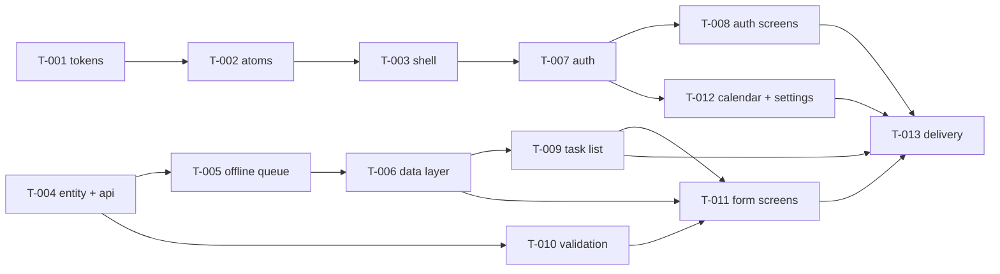

# SPEC-001 — Execution plan

## 1. Meta

| Field        | Value                               |
| ------------ | ----------------------------------- |
| Parent epic  | [SPEC-001: Focus & Flow](./epic.md) |
| Tasks source | [tasks.md](./tasks.md)              |
| Status       | `not-started`                       |
| Created      | 2026-09-01                          |
| Last updated | 2026-09-01                          |

### Execution preferences

| Field               | Value                                                    |
| ------------------- | -------------------------------------------------------- |
| Engine              | `task-tool`                                              |
| Stop mode           | `per-wave` — confirmed with the author at Wave 1 kickoff |
| Concurrency cap     | 3                                                        |
| Review enabled      | `true`                                                   |
| Review pattern      | `spot-check`                                             |
| Review fail action  | `revise`                                                 |
| Compliance critical | `false`                                                  |

`spot-check` rather than `adversarial` is a deliberate trade against a hard deadline. In
practice it reviews most of the spec anyway: the four `Risk: high` tasks are reviewed by rule,
and every screen task touches a checklist §1–§7 surface. The tasks it genuinely skips —
T-010's pure function, T-012's two placeholder screens — are the ones whose tests already
carry the whole contract. Every skip is logged in `review.log.md` by name, so nothing drops
silently.

---

## 2. Summary

- **Total tasks:** 13
- **Total waves:** 6
- **Critical path length:** 6
- **Estimated max parallelism:** 3

Two foundations open in parallel — the visual stack and the data stack — and stay independent
for three waves. They converge at Wave 4, where the task list first needs both real components
and real data. The last two waves are screens and delivery. The critical path runs entirely
through the data side, so a slip in the queue is a slip in the whole spec, which is why it is
scheduled second and reviewed hardest.

---

## 3. Dependency graph

---

## 4. Critical path

`T-004 → T-005 → T-006 → T-009 → T-011 → T-013` (length 6)

Parallelism cannot compress this chain. T-005 is the task to watch: it is the largest, the
riskiest, and everything downstream of it is on the path.

---

## 5. Dry-run preview

### 5.1 Path overlaps

| Wave | Tasks               | Overlapping path                                                           | Risk |
| ---- | ------------------- | -------------------------------------------------------------------------- | ---- |
| 2    | T-005, T-010        | none — `features/task-sync/` vs `entities/task/lib/`                       | low  |
| 5    | T-008, T-011, T-012 | all under `src/screens/`, different subdirectories                         | low  |
| 5    | T-011               | also touches `features/task-form/`, which nothing else in the wave touches | low  |

No two tasks in any wave write the same file. The layer split is doing its job.

### 5.2 External dependencies

- **Packages:** already installed and pinned — React Navigation 7, Zustand, TanStack Query,
  MMKV 2.12, FlashList 2.0, Reanimated 3.18, React Native Firebase 22.4, screens 4.11,
  safe-area-context 5.4. **No task may add a native dependency without re-running
  `pod install` and a build inside that same task.**
- **External services:** Firebase Auth (`todolist-b4a98`), mockapi.io tasks resource.
- **Assets:** Inter font files, added in T-001.

### 5.3 Toolchain

| Language                    | Tasks                             |
| --------------------------- | --------------------------------- |
| TypeScript                  | all                               |
| Objective-C / Xcode project | T-007 only (plist and URL scheme) |
| Markdown                    | T-013                             |

---

## 6. Execution waves

### Branching — deviation from the default, recorded

Task agents run in the **single shared working tree**, not on branches off a common base.
A git worktree per agent would isolate the code but would not carry `node_modules`, so the
agents could not run the type-check, lint, and test gates that make a hand-off meaningful —
isolation would be bought by disabling the Definition of Done. The safety that branching
would have provided comes instead from §5.1: no two tasks in a wave write the same file, and
that is verified before the wave starts. Each task lands as its own commit after its gates
pass.

### Wave 1 — foundations

- **Tasks:** T-001 (tokens), T-004 (entity + API)
- **Parallel agents:** 2
- **Integration checkpoint:** both merge cleanly; the theme contract and the `Task` type are
  the interfaces everything downstream quotes, so they are frozen at this point.
- **Review gate:** spot-check — both tasks reviewed (T-004 touches an external-API surface).

### Wave 2 — the two stacks diverge

- **Tasks:** T-002 (atoms), T-005 (offline queue), T-010 (validation)
- **Parallel agents:** 3
- **Blocked on:** Wave 1
- **Integration checkpoint:** T-005's tests are the gate for the whole offline claim. If its
  invariants are not all covered by tests that read storage back, the wave does not merge.
- **Review gate:** T-002 and T-005 reviewed; T-010 skipped by rule and logged.

### Wave 3 — assembly

- **Tasks:** T-003 (shell), T-006 (data layer)
- **Parallel agents:** 2
- **Blocked on:** Wave 2
- **Integration checkpoint:** the app launches into a navigable shell with real cached data
  behind the hooks. First point at which the thing is demonstrable.
- **Review gate:** both reviewed.

### Wave 4 — the two hard screens' prerequisites

- **Tasks:** T-007 (auth), T-009 (task list)
- **Parallel agents:** 2
- **Blocked on:** Wave 3
- **Integration checkpoint:** signing in on the simulator with the test number, and the task
  list rendering all five row states. This is the wave where the assignment becomes real, and
  where an auth surprise still has time to be absorbed.
- **Review gate:** both reviewed — both `Risk: high`.

### Wave 5 — remaining screens

- **Tasks:** T-008 (auth screens), T-011 (form screens), T-012 (calendar + settings)
- **Parallel agents:** 3
- **Blocked on:** Wave 4
- **Integration checkpoint:** every artboard has a screen. Full walkthrough on the simulator.
- **Review gate:** T-008 and T-011 reviewed; T-012 skipped by rule and logged.

### Wave 6 — delivery

- **Tasks:** T-013
- **Blocked on:** Wave 5
- **Integration checkpoint:** the clean-clone run and the full manual checklist.
- **Review gate:** author's read, then the epic-end hand-off.

---

## 8. Review gates

| Gate                    | When                                            | How triggered                                                                                                                                                                              | Notes                                                          |
| ----------------------- | ----------------------------------------------- | ------------------------------------------------------------------------------------------------------------------------------------------------------------------------------------------ | -------------------------------------------------------------- |
| Adversarial task review | per task, per the spot-check rule               | orchestrator spawns a reviewer subagent with the five permitted inputs                                                                                                                     | logged in `review.log.md`, skips included                      |
| Type-check, lint, tests | every task, before hand-off                     | the task agent, as its Definition of Done                                                                                                                                                  | non-negotiable                                                 |
| iOS build               | any task touching native config or dependencies | the task agent, inside the task                                                                                                                                                            | T-007 in particular                                            |
| Code review             | end of each wave                                | `/code-review` — **aspirational as of 2026-09-01**: the repository has no GitHub PR, so the plugin's precondition is unmet. Wave review is the adversarial reviewer plus the author's read | do not claim a gate that cannot fire                           |
| Security review         | —                                               | not wired; the app holds no secrets and no personal data beyond a phone number Firebase already has                                                                                        |                                                                |
| Thorough review         | epic end                                        | **the author runs `/code-review ultra`**                                                                                                                                                   | user-triggered and billable; the orchestrator cannot launch it |
| Functional acceptance   | epic end                                        | the author walks epic §18.4                                                                                                                                                                |                                                                |

---

## 9. Execution risk register

| Risk                                          | Likelihood | Impact | Mitigation                                                                                                      |
| --------------------------------------------- | ---------- | ------ | --------------------------------------------------------------------------------------------------------------- |
| T-005 overruns and drags the critical path    | medium     | high   | Its scope is fixed by epic §12.2. If it overruns, the cut is the Maestro flow in T-013, never the queue's tests |
| Firebase misbehaves on the simulator          | medium     | high   | T-007 is in Wave 4, not Wave 6; its manual checks run inside the task                                           |
| A native dependency needs adding mid-flight   | low        | high   | Forbidden without a pod install and a build in the same task                                                    |
| Wave 5's three screen tasks conflict at merge | low        | medium | Verified disjoint in §5.1                                                                                       |
| Design fidelity drifts from the artboards     | medium     | medium | Values come from the canvas sources; each screen task carries a side-by-side comparison as a manual item        |

---

## 10. Failure policy

Per `SKILL.md`. A blocked task is marked and its dependents deferred; the wave continues. If a
blocker invalidates an assumption in the epic, the plan pauses, the epic's version is bumped
with a §26 row, and the affected tasks are regenerated before anything else runs.

---

## 11. Progress log

Written by the orchestrator only.

| Task | Wave | Agent | Started | Completed | Status      | Notes                                |
| ---- | ---- | ----- | ------- | --------- | ----------- | ------------------------------------ |
| —    | —    | —     | —       | —         | not-started | Plan created; awaiting epic approval |
